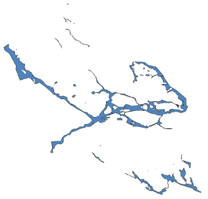
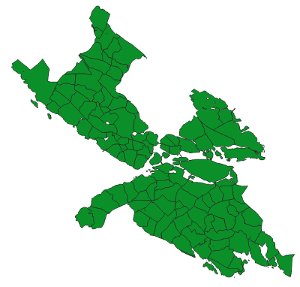

# Shapefiles and geojson files for Stockholm's stadsdelar/districts 

This repository contains the geodata files you need to create visualisations of Stockholm like
this choropleth map:


Source: [https://krasch.io/hyreskartan](https://krasch.io/hyreskartan)

The data is based on the "Stadskarta" dataset released on the [Stockholm open data portal](https://dataportalen.stockholm.se/)
under CC0 license (last updated: 2021-04-13) [[details]](#open-data-portal)

I am also releasing this data under CC0 license.

## Disambiguation

| Swedish | English | Explanation / examples |
| --------------- | --------------- | --------------- |
| Stadsdelsområde | Borough | Larger administrative unit, e.g. Rinkeby-Kista|
| Stadsdel | District | Smaller administrative unit, part of a Stadsdelsområde, e.g. Rinkeby, Akalla, Husby, Kista, Hansta  |
| Vatten | Water | Baltic sea, lakes, rivers |

Stockholm currently has 13 stadsdelsområden containing in total 117 stadsdelar. 

## File overview

##### Format

| Folder | Explanation | 
| --------------- | --------------- | 
| shapefiles | ESRI-Shapefile format, coordinate system=SWEREF99 (same as original files)
| geojson | geojson format, coordinate system=CRS84 |


##### Versions

| Subfolder | Explanation | 
| --------------- | --------------- | 
| fullsize | Same detail level as the original data
| simplified | Smaller file size, achieved by running [ST_SIMPLIFY](https://postgis.net/docs/ST_Simplify.html) with tolerance=3 |

##### Files

| Filename | Explanation | Screenshot |
| --------------- | --------------- | --------------- |
| stadsdelar.* | Boundaries of the stadsdelar including the water areas, 1 polygon per stadsdel | |
| vatten.* | Boundaries of all the water areas, merged together into 1 (multi-)polygon |  |
| stadsdelar_utan_vatten.* | Boundaries of the stadsdelar with the water areas removed, 1 polygon per stadsdel |  |

## Generating the files

In most cases, you should just go ahead and use the pre-generated
files that I am supplying in the "shapefiles" and "geojson" folders.
Use the following instructions if you want to generate the files on your own.

These instructions are valid for the 2021-04-13 release of the data in the open data portal. Previous
releases used rather different directory layouts (and future versions
might, too...)

##### Prerequisites

* [gdal](https://gdal.org/)

##### Getting the data

Navigate to the root folder of this repository. Then run
the following commands:

```
wget https://dataportalen.stockholm.se/dataportalen/Data/Stadsbyggnadskontoret/SHP_utanfastigheter_nya_granser.zip
unzip SHP_utanfastigheter_nya_granser.zip
mv SHP_utanfastigheter_nya_grДnser SHP_utanfastigheter_nya_gränser 
```

Check that everything is setup up correctly:

```
ogrinfo data.vrt.xml
```

Should output:

```
INFO: Open of `data.vrt.xml'
      using driver `OGR_VRT' successful.
1: vatten
2: stadsdelar (Polygon)
```

### Running the script

(you might have to make some adapations if you are on Windows)

```
./generate.sh
```


## Footnotes

##### Open data portal

Unfortunately it is not possible to directly link to the dataset page
in the open data portal. Here is how you can find it:

1. Go to [https://dataportalen.stockholm.se/](https://dataportalen.stockholm.se/)
2. Type "stadskartan" into the search, there will be multiple results
3. Scroll down to the item shown in the screenshot below


