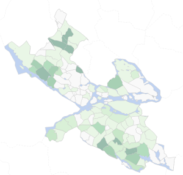
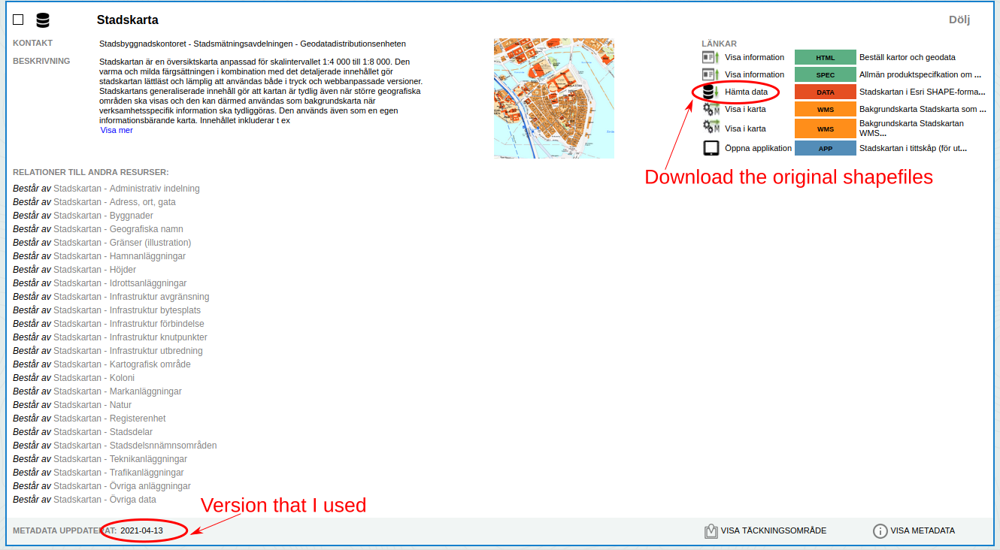

# Shapefiles and geojson files for Stockholm stadsdelar/districts 

This repository contains the geodata files you need to create visualisations of Stockholm like
this choropleth map:

Source: [https://krasch.io/hyreskartan](https://krasch.io/hyreskartan)

The data is based on the "Stadskarta" dataset released on the [Stockholm open data portal](https://dataportalen.stockholm.se/)
under CC0 license (last updated: 2021-04-13) [[details]](#open-data-portal)

## Vocabulary used in this repository

| Swedish | English | Explanation / examples |
| --------------- | --------------- | --------------- |
| Stadsdelsområde | Borough | Larger administrative unit, e.g. Rinkeby-Kista|
| Stadsdel | District | Smaller administrative unit, part of a Stadsdelsområde, e.g. Rinkeby, Akalla, Husby, Kista, Hansta  |
| Vatten | Water | Baltic sea, lakes, rivers |

Stockholm currently has 13 stadsdelsområden containing in total 117 stadsdelar. 

## Footnotes

### Open data portal

Unfortunately it is not possible to directly link to the dataset
in the open data portal. Here is how you can find it:

1. Go to [https://dataportalen.stockholm.se/](https://dataportalen.stockholm.se/)
2. Type "stadskartan" into the search, there will be multiple results
3. Scroll down to the item shown in the screenshot below

